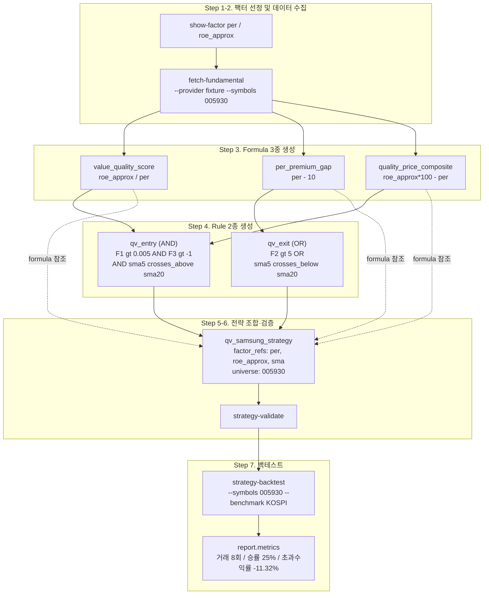

# No-Code Strategy Workspace

코드 없이 팩터(Factor)·산술 조합(Formula)·조건(Rule)을 선언적으로 조합해 전략을
설계 → 검증 → 백테스트 → Daily 운영 → 재사용(Template/Import·Export)까지 CLI로
완결하는 서브시스템.

설계 원천: [refined_epics/](../refined_epics/README.md) (PRD-R01 Factor Platform,
PRD-R02 Declarative Definition Core, PRD-R03 Workspace & Execution). 정의는 순수
JSON이며 코드·람다·수식 문자열을 저장·평가하지 않는다.

모든 정의 입력(`*-create`/`strategy-edit`/`strategy-import`)은 **JSON 파일 경로** 또는
**stdin**(`-`)을 받으며, `strategy-edit`은 항상 **전체 정의 교체**다(부분 필드 패치 없음).
미존재 id를 지정하면 오류 메시지에 현재 등록된 id 목록이 힌트로 함께 표시된다.

## 팩터 플랫폼 (Factor Platform)

가격·기술(7종), 밸류에이션(11종), 재무제표(14종) 총 32종의 지표(Factor)를 플랫폼이
1급 자원으로 관리합니다. 지표는 `factors/` 패키지가 순수 계산으로 제공하며,
펀더멘털 데이터(밸류에이션·재무제표)는 `data/` 패키지가 DuckDB에 저장·조회합니다.

| 카테고리 | 개수 | 예시 |
|---|---|---|
| 가격·기술 | 7 | `price`, `sma`, `ema`, `rsi`, `macd`, `bollinger`, `momentum` |
| 밸류에이션 | 11 | `per`, `pbr`, `eps`, `bps`, `roe_approx`, `peg`, `market_cap` 등 |
| 재무제표 | 14 | `roa`, `roic`, `gross_margin`, `revenue_growth`, `debt_to_equity` 등 |

---

## CLI 명령어 레퍼런스

### `list-factors` — 팩터 목록 조회

```bash
uv run python -m quant_krx list-factors [--category/-c CATEGORY]
```

| 옵션 | 의미 | 기본값 |
|---|---|---|
| `--category`, `-c` | 카테고리 필터. `FactorCategory` 열거값(예: `price`, `value`, `quality`, `growth`)만 허용 — 잘못된 값은 사용 가능 목록과 함께 오류 종료 | 없음(전체 출력) |

```bash
uv run python -m quant_krx list-factors
uv run python -m quant_krx list-factors --category value
```

### `show-factor` — 팩터 상세 조회

```bash
uv run python -m quant_krx show-factor FACTOR_ID
```

| 인자 | 의미 |
|---|---|
| `factor_id` (필수) | 조회할 팩터 id(예: `sma`, `per`, `roa`) |

출력: 표시명·카테고리·설명·산출 컬럼·필요 데이터(`ohlcv`/`valuation`/`financials`)·파라미터
명세(이름·타입·기본값·min/max/choices 제약). `required_data`에 `financials`가 포함된
팩터(재무제표 14종)는 DART 미구현으로 현재 NaN 반환된다는 안내가 함께 표시된다.

```bash
uv run python -m quant_krx show-factor macd
uv run python -m quant_krx show-factor roa   # 재무제표 팩터는 DART 미구현 안내 표시
```

### `fetch-fundamental` — 펀더멘털 데이터 수집

```bash
uv run python -m quant_krx fetch-fundamental [옵션들]
```

| 옵션 | 의미 | 기본값 |
|---|---|---|
| `--symbols`, `-s` | 콤마 구분 종목 코드 목록 | 생략 시 watchlist 전체 |
| `--start` | 수집 시작일(`YYYY-MM-DD`) | 종료일 5년 전 |
| `--end` | 수집 종료일(`YYYY-MM-DD`) | 오늘 |
| `--kind`, `-k` | 수집 종류: `valuation`(밸류에이션) \| `financials`(재무제표) \| `all` | `all` |
| `--provider`, `-p` | 데이터 제공자: `fixture`(오프라인 합성) \| `pykrx`(실 데이터, 밸류에이션만 지원) | `fixture` |

멱등 수집이며, PK 중복·미래 일자·음수 필드 위반 행은 저장에서 제외되고 결과 표에
제외 사유(종목:사유)가 함께 표시된다. `financials`는 DART 연동 전까지 `pykrx`
provider에서 미지원(오류 종료).

```bash
# 오프라인 테스트(Fixture) — 네트워크 없이 합성 데이터 수집
uv run python -m quant_krx fetch-fundamental --provider fixture --symbols 005930,000660

# 실 데이터 수집(PyKrx, 밸류에이션만 지원)
uv run python -m quant_krx fetch-fundamental --provider pykrx --kind valuation \
    --start 2024-01-01 --end 2024-12-31
```

---

### Formula — 파생 지표 정의

Formula는 팩터·상수·다른 Formula를 사칙연산(`+`/`-`/`*`/`/`/`neg`)으로 조합해 새 파생
지표를 만든다. JSON 필드:

| 필드 | 의미 |
|---|---|
| `id`, `name`, `version` | 정의 식별자·표시명·버전 문자열 |
| `expression` | 연산 트리(아래 노드 형상 참고) |
| `output_column` | 계산 결과 컬럼명(기본: `value`) |
| `metadata` | 자유 형식 부가 정보(선택) |

`expression` 노드는 `node`(binary/unary) 또는 `kind`(factor/constant/formula) 태그로
판별되며 동시 지정 불가:

| 태그 | 형상 | 의미 |
|---|---|---|
| `node: binary` | `{op: "+/-/*//", left, right}` | 이항 연산(피연산자는 하위 노드) |
| `node: unary` | `{op: "neg", operand}` | 단항 연산(부호 반전) |
| `kind: factor` | `{factor_id, column, params}` | 팩터 참조 — `params`는 해당 팩터의 `ParamSpec`을 덮어씀(예: `sma`의 `window`) |
| `kind: constant` | `{value}` | 상수(int/float, bool·NaN·inf 불가) |
| `kind: formula` | `{formula_id, column}` | 다른 Formula 참조(합성) |

예시(`sma(5) - sma(20)`, 골든크로스 스프레드):

```json
{
  "id": "sma_spread",
  "name": "SMA 5-20 스프레드",
  "version": "1",
  "expression": {
    "node": "binary",
    "op": "-",
    "left": {"kind": "factor", "factor_id": "sma", "column": "sma", "params": {"window": 5}},
    "right": {"kind": "factor", "factor_id": "sma", "column": "sma", "params": {"window": 20}}
  },
  "output_column": "value"
}
```

#### `formula-create` — 생성/전체교체

```bash
uv run python -m quant_krx formula-create INPUT_SOURCE
```

| 인자 | 의미 |
|---|---|
| `input_source` (필수) | Formula JSON 파일 경로 또는 `-`(stdin) |

동일 id가 이미 있으면 전체 교체(upsert)된다.

```bash
uv run python -m quant_krx formula-create my_formula.json
```

#### `formula-show` — JSON 조회

```bash
uv run python -m quant_krx formula-show FORMULA_ID
```

| 인자 | 의미 |
|---|---|
| `formula_id` (필수) | 조회할 Formula id |

```bash
uv run python -m quant_krx formula-show my_formula
```

#### `formula-delete` — 삭제

```bash
uv run python -m quant_krx formula-delete FORMULA_ID
```

| 인자 | 의미 |
|---|---|
| `formula_id` (필수) | 삭제할 Formula id — Strategy/다른 Formula가 참조 중이면 거부 |

```bash
uv run python -m quant_krx formula-delete my_formula
```

#### `list-formulas` — 목록

```bash
uv run python -m quant_krx list-formulas
```

인자/옵션 없음. 저장된 모든 Formula의 id·name·output_column을 표로 출력한다.

---

### Rule — 조건 정의

Rule은 Predicate(비교 연산)와 Composition(논리 연산)으로 조건 트리를 구성한다. JSON 필드:

| 필드 | 의미 |
|---|---|
| `id`, `name`, `version` | 정의 식별자·표시명·버전 문자열 |
| `root` | 조건 트리 루트 노드(아래 노드 형상 참고) |
| `metadata` | 자유 형식 부가 정보(선택) |

`root` 노드는 `node` 태그로 판별:

| `node` 값 | 형상 | 의미 |
|---|---|---|
| `predicate` | `{left, operator, right}` | 두 피연산자 비교. `operator`: `>`, `>=`, `<`, `<=`, `==`, `!=`, `crosses_above`, `crosses_below` |
| `composition` | `{op, operands}` | 논리 결합. `op`: `AND`/`OR`(피연산자 2개 이상), `NOT`(정확히 1개) |

Predicate의 `left`/`right` 피연산자는 `kind` 태그로 판별(Formula의 피연산자와 동일 형상,
단 Rule 패키지 전용 타입 — 상호 참조 없음):

| `kind` | 형상 | 의미 |
|---|---|---|
| `factor` | `{factor_id, column, params}` | 팩터 참조(파라미터 오버라이드 지원) |
| `constant` | `{value}` | 상수(int/float) |
| `formula` | `{formula_id, column}` | Formula 참조 |

예시(`sma(5) > sma(20)`, 골든크로스 진입 조건):

```json
{
  "id": "entry_rule",
  "name": "골든크로스 진입",
  "version": "1",
  "root": {
    "node": "predicate",
    "left": {"kind": "factor", "factor_id": "sma", "column": "sma", "params": {"window": 5}},
    "operator": ">",
    "right": {"kind": "factor", "factor_id": "sma", "column": "sma", "params": {"window": 20}}
  }
}
```

#### `rule-create` — 생성/전체교체

```bash
uv run python -m quant_krx rule-create INPUT_SOURCE
```

| 인자 | 의미 |
|---|---|
| `input_source` (필수) | Rule JSON 파일 경로 또는 `-`(stdin) |

```bash
uv run python -m quant_krx rule-create my_rule.json
```

#### `rule-show` — JSON 조회

```bash
uv run python -m quant_krx rule-show RULE_ID
```

| 인자 | 의미 |
|---|---|
| `rule_id` (필수) | 조회할 Rule id |

```bash
uv run python -m quant_krx rule-show my_rule
```

#### `rule-delete` — 삭제

```bash
uv run python -m quant_krx rule-delete RULE_ID
```

| 인자 | 의미 |
|---|---|
| `rule_id` (필수) | 삭제할 Rule id — Strategy가 참조 중이면 거부 |

```bash
uv run python -m quant_krx rule-delete my_rule
```

#### `list-rules` — 목록

```bash
uv run python -m quant_krx list-rules
```

인자/옵션 없음. 저장된 모든 Rule의 id·name을 표로 출력한다.

---

### Strategy — 전략 정의

Strategy는 사용할 팩터(`factor_refs`), 대상 종목(`universe`), 진입/청산 조건(`rule`)을
묶는 최상위 정의다. JSON 필드:

| 필드 | 의미 |
|---|---|
| `id`, `name`, `version` | 정의 식별자·표시명·버전 문자열 |
| `factor_refs` | `[{factor_id, params}, ...]` — 전략이 사용하는 팩터 목록(최소 1개), `params`로 파라미터 오버라이드 |
| `universe` | `{symbols: [...]}` — KRX 6자리 종목 코드 목록. 빈 목록이면 실행 시 watchlist 전체가 대상 |
| `rule` | `null`(초안, 미실행 가능) 또는 `{roles: {entry: [rule_id, ...], exit: [rule_id, ...]}}`. `entry`는 1개 이상 필수(exit는 선택) — 이 조건을 만족해야 **runnable**(실행 가능)로 판정된다 |
| `metadata` | 자유 형식 부가 정보(선택) |

예시(MA 크로스오버 전략):

```json
{
  "id": "my_ma_strategy",
  "name": "MA 크로스오버",
  "version": "1",
  "factor_refs": [
    {"factor_id": "sma", "params": {"window": 5}},
    {"factor_id": "sma", "params": {"window": 20}}
  ],
  "universe": {"symbols": ["005930", "000660"]},
  "rule": {"roles": {"entry": ["entry_rule"], "exit": []}}
}
```

#### `strategy-create` — 생성(신규 JSON 또는 Template 복제)

```bash
uv run python -m quant_krx strategy-create NEW_ID [INPUT_SOURCE] [--template TEMPLATE_ID]
```

| 인자/옵션 | 의미 |
|---|---|
| `new_id` (필수) | 새로 생성할 전략 id |
| `input_source` | Strategy JSON 파일 경로 또는 `-`(stdin) — `--template` 미지정 시 필수. JSON 내부 `id`가 `new_id`와 다르면 `new_id`로 교체됨 |
| `--template` | 이 Template id(Built-in 5종 또는 사용자 Template)를 복제해 `new_id`로 생성 |

```bash
uv run python -m quant_krx strategy-create my_strategy my_strategy.json
uv run python -m quant_krx strategy-create my_ma --template ma_crossover
```

#### `strategy-show` — JSON 조회

```bash
uv run python -m quant_krx strategy-show STRATEGY_ID
```

| 인자 | 의미 |
|---|---|
| `strategy_id` (필수) | 조회할 전략 id |

```bash
uv run python -m quant_krx strategy-show my_strategy
```

#### `strategy-edit` — 전체 교체 수정

```bash
uv run python -m quant_krx strategy-edit STRATEGY_ID INPUT_SOURCE
```

| 인자 | 의미 |
|---|---|
| `strategy_id` (필수) | 수정할 전략 id |
| `input_source` (필수) | 새 정의 전체를 담은 JSON 파일 경로 또는 `-`(stdin) — JSON 내부 `id`는 반드시 `strategy_id`와 일치해야 함(불일치 시 오류) |

부분 필드 패치는 지원하지 않는다 — JSON은 항상 정의 전체를 대체한다. 활성 전략은
수정이 거부된다(먼저 `strategy-deactivate` 필요).

```bash
uv run python -m quant_krx strategy-edit my_strategy my_strategy_v2.json
```

#### `strategy-delete` — 삭제

```bash
uv run python -m quant_krx strategy-delete STRATEGY_ID
```

| 인자 | 의미 |
|---|---|
| `strategy_id` (필수) | 삭제할 전략 id — 활성 상태면 거부 |

```bash
uv run python -m quant_krx strategy-delete my_strategy
```

#### `strategy-list` — 목록

```bash
uv run python -m quant_krx strategy-list
```

인자/옵션 없음. 저장된 모든 전략의 id·name·활성 상태(ON/OFF)·runnable(진입 조건
보유 여부, Y/N)을 표로 출력한다.

#### `strategy-validate` — 실행 없는 사전 검증

```bash
uv run python -m quant_krx strategy-validate STRATEGY_ID
```

| 인자 | 의미 |
|---|---|
| `strategy_id` (필수) | 검증할 전략 id |

참조 무결성(dangling factor/formula/rule id, 순환 참조 등)을 실행 없이 점검한다.
실패 시 오류 목록과 함께 non-zero 종료.

```bash
uv run python -m quant_krx strategy-validate my_strategy
```

#### `strategy-activate` / `strategy-deactivate` — Daily 실행 집합 편입/제외

```bash
uv run python -m quant_krx strategy-activate STRATEGY_ID
uv run python -m quant_krx strategy-deactivate STRATEGY_ID
```

| 인자 | 의미 |
|---|---|
| `strategy_id` (필수) | 활성화/비활성화할 전략 id |

활성화는 runnable(entry rule 존재) + 검증 통과를 전제로 한다. Daily(`run-daily`)는
활성 전략 집합만 실행한다(전략 원천 단일화). 활성 전략과 그 전략이 참조 중인
Rule/Formula는 수정·삭제가 거부되므로, 편집이 필요하면 먼저 비활성화한다.

```bash
uv run python -m quant_krx strategy-activate my_strategy
uv run python -m quant_krx strategy-deactivate my_strategy
```

#### `strategy-template-list` — Template 열거

```bash
uv run python -m quant_krx strategy-template-list
```

인자/옵션 없음. Built-in Template 5종 + 사용자 정의 Template을 출처(`origin`)
구분과 함께 통합 열거한다.

#### `strategy-export` / `strategy-import` — Template/공유용 번들

```bash
uv run python -m quant_krx strategy-export STRATEGY_ID [--output/-o PATH]
uv run python -m quant_krx strategy-import INPUT_SOURCE [--overwrite]
```

| 인자/옵션 | 의미 |
|---|---|
| `strategy_id` (export, 필수) | 내보낼 전략 id |
| `--output`, `-o` (export) | 저장할 파일 경로. 생략 시 stdout으로 JSON 출력 |
| `input_source` (import, 필수) | 번들 JSON 파일 경로 또는 `-`(stdin) |
| `--overwrite` (import) | id 충돌 시 기존 정의를 대체. 단, 활성 전략/참조 보호가 우선이므로 활성 중인 대상은 여전히 거부됨 |

Export는 전략 + 전이 참조된 Rule·Formula를 하나의 결정론적 직렬화 JSON 번들로
묶는다(동일 입력 → 항상 동일 바이트열). Import는 번들을 위상 순서
(Formula → Rule → Strategy)로 복원한다.

```bash
uv run python -m quant_krx strategy-export my_strategy --output my_strategy_bundle.json
uv run python -m quant_krx strategy-import my_strategy_bundle.json
uv run python -m quant_krx strategy-import my_strategy_bundle.json --overwrite
```

---

### `strategy-backtest` — 백테스트 실행

```bash
uv run python -m quant_krx strategy-backtest STRATEGY_ID [옵션들]
```

| 인자/옵션 | 의미 | 기본값 |
|---|---|---|
| `strategy_id` (필수) | 백테스트할 전략 id(runnable + 검증 통과 상태여야 함) | — |
| `--symbols` | 콤마 구분 종목 목록 | 생략 시 전략 `universe.symbols`, 그마저 비어있으면 watchlist |
| `--start` | 백테스트 시작일(`YYYY-MM-DD`) | 종료일 5년 전 |
| `--end` | 백테스트 종료일(`YYYY-MM-DD`) | 오늘 |
| `--fees` | 거래당 수수료율 | `0.003` |
| `--slippage` | 거래당 슬리피지율 | `0.001` |
| `--data-source` | OHLCV 데이터 소스: `fixture`(오프라인 합성) \| `fdr` \| `pykrx` | `fixture` |
| `--benchmark` | 벤치마크 심볼/시장(예: `KOSPI`) — 지정 시 벤치마크 수익률·초과수익률을 함께 산출. 수집 실패는 경고만 남기고 백테스트는 계속 진행 | 없음 |

전략이 밸류에이션/재무제표 팩터를 참조하면 지정한 `--data-source`에 맞는 펀더멘털
provider로 자동 선행 수집된다. 종목이 2개 이상이면 표 제목에 대표 종목(첫 번째
심볼)이 표기되고, 종목별 상세 지표는 `report.per_symbol`을 통해 별도 확인한다.

```bash
uv run python -m quant_krx strategy-backtest my_strategy --data-source fixture
uv run python -m quant_krx strategy-backtest my_strategy --data-source fixture --benchmark KOSPI
```

---

## Built-in Template

최초 `run-daily` 실행 시 아래 5종이 자동으로 생성·활성화되어 끊김 없이 운영됩니다
(전략 원천 단일화 — 코드형 전략은 존재하지 않으며 전부 선언형 정의로 대체되었습니다).

| 이름 | 유형 | 핵심 아이디어 |
|------|------|--------------|
| `ma_crossover` | 추세 추종 | 단기(20일)/장기(60일) MA 골든·데드크로스 |
| `rsi_breakout` | 역추세 | RSI 30 이하 매수 / 70 이상 매도 |
| `bollinger_band` | 평균 회귀 | 가격이 밴드(MA ± 2σ) 이탈 시 신호 |
| `macd` | 모멘텀 | 12/26 EMA 차이의 9일 시그널선 교차 |
| `momentum` | 중장기 추세 | 12-1개월 가격 모멘텀 (Jegadeesh & Titman) |

사용자 전략은 Formula/Rule을 조합해 직접 정의하거나 Template를 복제
(`strategy-create --template`)해 만들 수 있습니다.

---

## End-to-End 예제: 삼성전자 퀄리티-밸류 전략

펀더멘털 팩터 2종(`per`, `roe_approx`)을 선정해 Formula 3개·Rule 2개를 새로
만들고, 이를 조합한 전략을 삼성전자(`005930`)에 백테스트하는 전 과정이다.
아래 명령어와 JSON은 실제로 실행해 검증했다(Fixture 데이터, `strategy-backtest`
결과 거래 8회 발생 확인).

### Step 1 — 펀더멘털 팩터 2종 선정

`per`(주가수익비율, `value` 카테고리)와 `roe_approx`(ROE 근사치, `quality`
카테고리)를 선정한다. 둘 다 `required_data=valuation`이라 `fetch-fundamental`로
밸류에이션 데이터를 먼저 확보해야 한다.

```bash
uv run python -m quant_krx show-factor per
uv run python -m quant_krx show-factor roe_approx
```

### Step 2 — 펀더멘털 데이터 수집

```bash
uv run python -m quant_krx fetch-fundamental --provider fixture --symbols 005930 --kind valuation
```

### Step 3 — Formula 3종 생성

**① `value_quality_score`** — `roe_approx / per`. 값이 클수록 이익 대비
저평가(낮은 PER)이면서 수익성(ROE)이 높다는 뜻이다.

```json
{
  "id": "value_quality_score",
  "name": "퀄리티-밸류 스코어",
  "version": "1",
  "expression": {
    "node": "binary",
    "op": "/",
    "left": {"kind": "factor", "factor_id": "roe_approx", "column": "roe_approx", "params": {}},
    "right": {"kind": "factor", "factor_id": "per", "column": "per", "params": {}}
  },
  "output_column": "value"
}
```

**② `per_premium_gap`** — `per - 10`. 가정한 업종 평균 PER(10배) 대비
프리미엄/할인 폭.

```json
{
  "id": "per_premium_gap",
  "name": "PER 프리미엄 갭",
  "version": "1",
  "expression": {
    "node": "binary",
    "op": "-",
    "left": {"kind": "factor", "factor_id": "per", "column": "per", "params": {}},
    "right": {"kind": "constant", "value": 10}
  },
  "output_column": "value"
}
```

**③ `quality_price_composite`** — `(roe_approx * 100) - per`. ROE(%)에서
PER을 차감한 합성 스코어로, 값이 클수록 매력적인 종목으로 본다.

```json
{
  "id": "quality_price_composite",
  "name": "퀄리티-프라이스 합성 스코어",
  "version": "1",
  "expression": {
    "node": "binary",
    "op": "-",
    "left": {
      "node": "binary",
      "op": "*",
      "left": {"kind": "factor", "factor_id": "roe_approx", "column": "roe_approx", "params": {}},
      "right": {"kind": "constant", "value": 100}
    },
    "right": {"kind": "factor", "factor_id": "per", "column": "per", "params": {}}
  },
  "output_column": "value"
}
```

```bash
uv run python -m quant_krx formula-create value_quality_score.json
uv run python -m quant_krx formula-create per_premium_gap.json
uv run python -m quant_krx formula-create quality_price_composite.json
```

### Step 4 — Rule 2종 생성

**① `qv_entry`(진입, AND 3항)** — 두 펀더멘털 필터(①·③번 Formula)를 모두
통과하면서, 동시에 단기(5일)/중기(20일) 이동평균이 골든크로스(`crosses_above`)한
날에 진입한다. 펀더멘털이 "매력적인 종목인가"를 걸러내고, 기술적 크로스가
"언제 살 것인가" 타이밍을 정하는 조합이다.

```json
{
  "id": "qv_entry",
  "name": "퀄리티-밸류 진입",
  "version": "1",
  "root": {
    "node": "composition",
    "op": "AND",
    "operands": [
      {
        "node": "predicate",
        "left": {"kind": "formula", "formula_id": "value_quality_score", "column": "value"},
        "operator": ">",
        "right": {"kind": "constant", "value": 0.005}
      },
      {
        "node": "predicate",
        "left": {"kind": "formula", "formula_id": "quality_price_composite", "column": "value"},
        "operator": ">",
        "right": {"kind": "constant", "value": -1}
      },
      {
        "node": "predicate",
        "left": {"kind": "factor", "factor_id": "sma", "column": "sma", "params": {"window": 5}},
        "operator": "crosses_above",
        "right": {"kind": "factor", "factor_id": "sma", "column": "sma", "params": {"window": 20}}
      }
    ]
  }
}
```

**② `qv_exit`(청산, OR 2항)** — PER 프리미엄이 5배를 초과해 과열되었거나
(②번 Formula), 이동평균이 데드크로스(`crosses_below`)하면 청산한다.

```json
{
  "id": "qv_exit",
  "name": "퀄리티-밸류 청산",
  "version": "1",
  "root": {
    "node": "composition",
    "op": "OR",
    "operands": [
      {
        "node": "predicate",
        "left": {"kind": "formula", "formula_id": "per_premium_gap", "column": "value"},
        "operator": ">",
        "right": {"kind": "constant", "value": 5}
      },
      {
        "node": "predicate",
        "left": {"kind": "factor", "factor_id": "sma", "column": "sma", "params": {"window": 5}},
        "operator": "crosses_below",
        "right": {"kind": "factor", "factor_id": "sma", "column": "sma", "params": {"window": 20}}
      }
    ]
  }
}
```

```bash
uv run python -m quant_krx rule-create qv_entry.json
uv run python -m quant_krx rule-create qv_exit.json
```

### Step 5 — 전략 조합·생성

`factor_refs`는 Rule/Formula가 전이 참조하는 factor id 집합과 정확히 일치해야
한다(`strategy-validate`가 누락/잉여를 검사) — 여기서는 `per`, `roe_approx`,
그리고 진입/청산 타이밍에 쓰인 `sma` 세 개다.

```json
{
  "id": "qv_samsung_strategy",
  "name": "삼성전자 퀄리티-밸류 전략",
  "version": "1",
  "factor_refs": [
    {"factor_id": "per", "params": {}},
    {"factor_id": "roe_approx", "params": {}},
    {"factor_id": "sma", "params": {}}
  ],
  "universe": {"symbols": ["005930"]},
  "rule": {"roles": {"entry": ["qv_entry"], "exit": ["qv_exit"]}}
}
```

```bash
uv run python -m quant_krx strategy-create qv_samsung_strategy qv_samsung_strategy.json
```

### Step 6 — 사전 검증

```bash
uv run python -m quant_krx strategy-validate qv_samsung_strategy
# → 전략 'qv_samsung_strategy' 검증 통과
```

### Step 7 — 삼성전자 백테스트

```bash
uv run python -m quant_krx strategy-backtest qv_samsung_strategy \
    --symbols 005930 --data-source fixture --benchmark KOSPI
```

Fixture 데이터 기준 실행 결과(재현 가능):

| 지표 | 값 |
|---|---|
| 총수익률 | -5.64% |
| MDD | 22.39% |
| Sharpe | -0.249 |
| 승률 | 25.00% |
| 거래 횟수 | 8 |
| 벤치마크 수익률(KOSPI) | 5.69% |
| 초과수익률 | -11.32% |

### 전체 흐름 다이어그램


